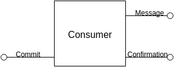
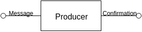
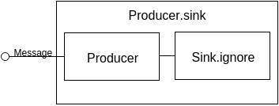

Reactive Streams for Kafka. New API
====

# Consumer #

## Core ##

Consumer in new API represents two processes:
 - message emit
 - offset commit

The message emit represented as a `message` `Out` and the offset commit represented as a `commit` `In` and a `confirmation` `Out`.



You can create such consumer via `Consumer.apply` method.

Here is an example consumer usage:


```scala
  val graph = GraphDSL.create(Consumer[Array[Byte], String](provider)) { implicit b => kafka =>
    import GraphDSL.Implicits._
    type In = ConsumerRecord[Array[Byte], String]
    val processing = Flow[In].map{ x => ??? /* your logic here */ ; x }
    val shutdownHandler: Sink[Any, Unit] = ??? // your logic here

    kafka.messages ~> processing ~> Consumer.record2commit ~> kafka.commit
    kafka.confirmation ~> shutdownHandler
    ClosedShape
  }

```

## Consumer control ##

To control consumer you should use `Control` object given after materialization:

```scala
val control = RunnableGraph.fromGraph(graph).run()
```

`Control` provides one method `stop` which issues stopping of the consumer. After you call `stop` the consumer asynchronously completes a `message` `Out` and will wait for a `commit` `In` completion. After the `commit` completes the consumer will wait for all confirmations to be completed and next will complete itself.

## Simple shapes ##

You can use simpler shapes based on a consumer shape.

If you do not care about offset confirmations then the consumer may be represented as `Flow` and created via `Consumer.flow`:


If you do not care about offset commit at all you may represent consumer as a message `Source` and create it via `Consumer.source`:


# Producer #

Producer represents a process of message publishing to kafka and getting confirmation of this publication.

Producer is represented as a `Flow` shape and may be created with `Producer.apply` method.



If you do not care about confirmation you can use producer as `Sink` and create it with `Producer.sink`.



To complete producer just complete it `In`. <!-- something missing here?? -->

# Consumer and producer providers

To use producer and consumer in akka streams you should pass an information how to create kafka's producer/consumer.
You can not pass it directly, because shapes and graphs should be reusable and kafka's producer/consumer are not thread safe.

Reactive kafka provides an API to pass information how to create consumer/producer. On shapes level it is just `() => Producer` and `() => Consumer`. On user level it is an API
which allows you to stack setup aspects.

## Consumer provider ##
Here is an example of consumer provider usage:
```scala
val consumerProvider =
    ConsumerProvider("localhost:9092", new ByteArrayDeserializer, new StringDeserializer) //1
    .setup(TopicSubscription("someTopic")) //2
    .groupId("myGroup") //3
    .autoCommit(false) //4
    .prop("auto.offset.reset", "earliest") //5

val consumer = consumerProvider.apply() //6
```

1. You should pass kafka server/port and deserializer to create basic consumer.
2. There are several ways to setup a consumer offset. You can subscribe to topic/topics with `TopicSubscription` by passing some topics. Also you can manually set topics partitions and they offsets with `ManualOffset`, or left it "as is" with `NoSetup`.
3. Set group id
4. Set autocommit
5. Set any other property
6. Create an instance of a kafka consumer

## Producer provider ##

Here it is an example of producer provider usage:
```scala
val producerProvider = 
    ProducerProvider[Array[Byte], String]("localhost:9092", new ByteArraySerializer, new StringSerializer)
    .props("some.props" -> "value")

val producer = producerProvider.apply()
```
